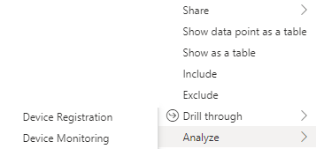

# Reporting and Monitoring 
Connected Office Initiative (COI) encapsulates the use of IoT devices
within the network placed over the office building, to collecte and share
data that these devices gather. In this project I create a Report in Power BIwith three pages:
* High-level Metrics - contains the important metrics of the data such as the number of devices in a category/zone
* Device Monitoring - contains the granula details about all the devices or the device drilled from the high-level metric 
* Device Registration - contains details details about all the registered devices or the a sigle device drilled from the high-level metric 

These pages showcase the data that these devices share.  The report can be shared with 
different stakeholders to see important information about the status of the IoT devices 
registration on verious platform.

### Table of Contents
1. [Header](#h)
2. [High-level Metrics](#hlm)  
2.1 [drill-through](#drillF)  
2.2 [drill-down](#drillB)  
3. [Device Monitoring](#dm)
4. [Device Registration](#dr)

      
#### 1. Header  
The Header will be visible in all the three reports and it shows:
* Slicers for  device platforms, categories, sub-categories, and zones,
* Total number of online devices, and
* Total number of all the device, categories, sub-categories, and zones.

>

      
#### 1. High-level Metrics  
The high-level metric page shows the importance business metrics such as:
* The total number of devices in a specific category/device
* The total number of online and offline devices.

>

      
#### 1.1 Drill-Through  
For each of the device in the bar chart when clicked a user can drill through (jump to another page) by right clicking the device and easily choose the page the want to navigate to.

>

      
#### 1.2 Drill-Down  
To drill down (jump back to the high-level metric) easily click on the drill down button shown below

>

      
#### 2. Device Monitoring  
Device monitoring page shows all the registered devices with the status and whether the device is active or not.
* Slicers for status if the device and whether the device is active or not  can be used to filter the data
* When the drill-through is used in the high-level metric to the monitoring page, the page will only show data of the drilled device, and 
* The drill-down button can be used at the bottom left corner to move back to the high-level metric

>

      
#### 3. Device Registration  
Device registration page all the registered devices with the date the device was installed.
* The line chart shows the total number of devices installed by year
* The metric show the actual date the device was installed

>

#### Help and Support 
---
 * marijkec
 * JacquiM